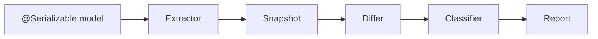
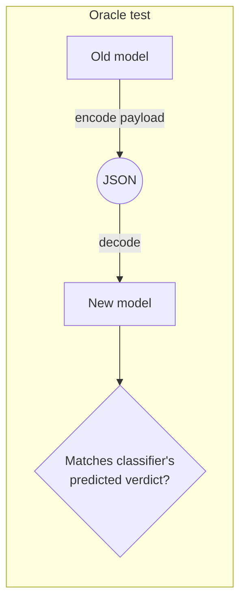
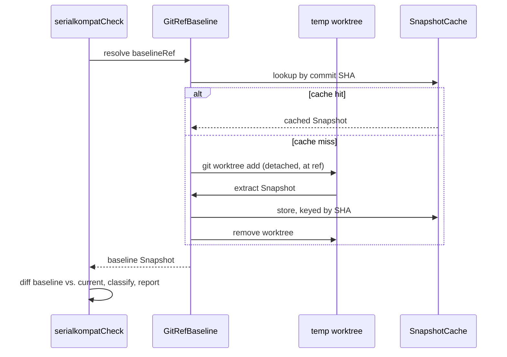

# Deep dive

How extraction, classification, and the git-ref baseline model actually work.
For user-facing config see [Configuration](configuration.md); for the full
rule matrix see [Rules](rules.md).

## Architecture

Extraction is the only stage that touches a runtime `SerialDescriptor` or the
JVM; everything from `Snapshot` onward is pure data. The `Differ` and
`Classifier` — the core compatibility engine — live in `serialkompat-core`,
which is plain Kotlin with **no I/O and no kotlinx-serialization runtime
dependency**: it never touches a file, a git repo, or a live descriptor. That
separation is why the same engine backs the Gradle plugin, the CLI, and any
future front end without duplicating rule logic, and why the rules can be
unit-tested against plain data without spinning up serialization at all.

## Extraction

`SnapshotExtractor` walks a compiled `SerialDescriptor` graph (BFS from the
configured root types, visited-set to handle cycles and shared types) and
records, per element: its **wire key** (after `@SerialName` and any
`namingStrategy` — the actual JSON key, not the Kotlin property name),
optionality, nullability, and type. Enum values, sealed subtypes, and
`SerializersModule`-resolved open polymorphism are all walked into the same
`Snapshot`.

Not everything is analysable — a contextual serializer that isn't resolvable
at extraction time, or an unrecognized `SerialKind`, doesn't get skipped or
guessed at. It's recorded as an explicit `ContractKind.OPAQUE` coverage gap:
present in the snapshot, diffable, and round-trippable, but flagged. This is
load-bearing: **the extractor never throws on a model it can't fully analyse,
and unanalysable never means safe** — the classifier turns every
`COVERAGE_GAP` into a `WARN`, not a silent pass.

## Classification and the oracle

The `Classifier` takes the structural `Change`s the `Differ` found between two
snapshots and scores each one per direction (`BACKWARD`/`FORWARD`/`FULL`) and
per the real `Json { }` config in play (`ignoreUnknownKeys`,
`encodeDefaults`, `explicitNulls`, `coerceInputValues`, and more) — the same
change can be `SAFE` under one reader config and `BREAK` under another. See
[Rules](rules.md) for the full matrix.

None of that is derived from reading kotlinx-serialization's source or spec.
Every rule is backed by a round-trip oracle test: serialize a payload with the
old model, decode it with the new one (and the reverse), using the real
kotlinx-serialization library under the declared config, and assert the
classifier's predicted severity matches what actually happened.

A rule that isn't backed by this oracle isn't trusted to ship — it's how
"the classifier predicts `SAFE`" becomes a verified claim about real decode
behavior instead of an assumption about the spec.

## The git-ref baseline

`baselineRef` isn't a file you commit and can forget to update. `GitRefBaseline`
checks the ref out into a temporary detached git worktree, extracts its schema
the same way as the current one, and diffs live — every run compares against
what's *actually* on that ref right now, not a snapshot someone forgot to
regenerate.

The result is cached content-addressed by commit SHA, so re-running against
the same ref doesn't re-extract. A stale worktree left behind by an
interrupted run is pruned and cleaned up automatically on the next invocation,
so the gate self-heals instead of wedging. Ref resolution is fail-closed: a
ref that doesn't resolve fails the run rather than silently comparing against
nothing.

## Further reading

This page is a summary. The full engineering spec — design rationale, the
complete data model, and the reasoning behind each invariant — lives in the
repo at
[`docs/design`](https://github.com/chrisjenx/serialkompat/tree/main/docs/design).

## Next

- [Rules](rules.md) — the full classifier rule matrix.
- [Recipes](recipes.md) — task-oriented usage.
