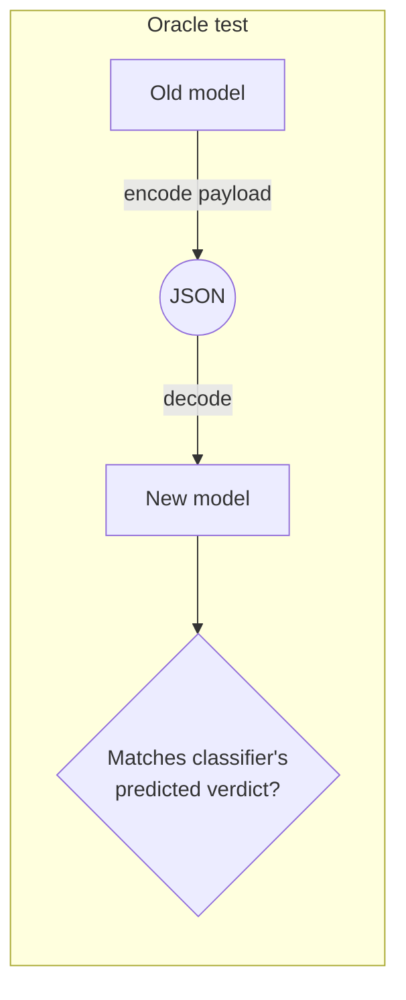
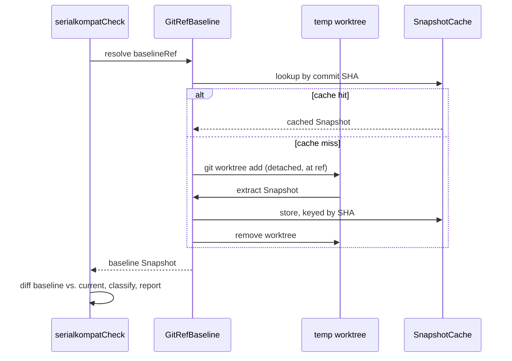

# Deep dive

This page explains how serialkompat works inside: extraction, classification, and
the git-ref baseline. For the settings you can change, see
[Configuration](configuration.md). For the full rule matrix, see [Rules](rules.md).

## Architecture

```mermaid
flowchart LR
    A["@Serializable model"] --> B[Extractor]
    B --> C[Snapshot]
    C --> D[Differ]
    D --> E[Classifier]
    E --> F[Report]
```

Extraction is the only stage that touches a runtime `SerialDescriptor` or the JVM.
Everything from `Snapshot` onward is plain data.

The compatibility engine (the `Differ` and the `Classifier`) lives in
`serialkompat-core`. That module is plain Kotlin with **no I/O and no
kotlinx-serialization runtime dependency**. It never touches a file, a git repo, or
a live descriptor.

This separation has two payoffs. The Gradle plugin and the CLI share one engine, so
rule logic is never duplicated. And the rules can be unit-tested against plain
data, without running serialization at all.

## Extraction

The extractor runs in a separate JVM on your project's own runtime classpath, ahead
of its own dependencies. It loads your real compiled `@Serializable` classes,
against the kotlinx-serialization version your project actually uses.

It finds the types to check in one of two ways. You can list them explicitly, or it
can scan your compiled class directories for `@Serializable` classes. The discovery
mode (`EXPLICIT`, `OPT_OUT`, or `OPT_IN`) decides which scanned types count. See
[Configuration](configuration.md) for details.

From those root types, `SnapshotExtractor` walks the `SerialDescriptor` graph
breadth-first. A visited set handles cycles and shared types. For each element it
records:

- the **wire key**: the actual JSON key after `@SerialName` and any
  `namingStrategy`, not the Kotlin property name;
- whether it's optional and whether it's nullable;
- its type;
- for optional fields, its `@EncodeDefault` mode.

`@EncodeDefault` isn't visible through the descriptor, so the extractor reads it
from the compiled class's bytecode. If it can't read the annotation (for example,
behind a hand-written serializer), it records the mode as unknown. It never
assumes the annotation is absent.

Enum values, sealed subtypes, and open polymorphism resolved through the
`SerializersModule` all go into the same `Snapshot`.

### When a type can't be analysed

Some types can't be analysed. Examples are a `@Contextual` field (its real
serializer is picked at runtime, so the descriptor doesn't show its shape), an
unrecognized `SerialKind`, a generic sealed hierarchy, or a class file that can't
be read. The extractor doesn't skip these or guess. It records each one as an
`OPAQUE` contract: present in the snapshot, diffable, and round-trippable, but
flagged.

This is a core guarantee: **the extractor never throws on a model it can't fully
analyse, and unanalysable never means safe.** The classifier reports every opaque
type as a `COVERAGE_GAP` `WARN`, never a silent pass.

## Classification and the oracle

The `Differ` lists the structural `Change`s between two snapshots. The
`Classifier` then scores each change per direction:

- **backward**: new code reads data written by old code;
- **forward**: old code reads data written by new code.

`FULL` checks both. Scoring also uses the real `Json { }` config in play
(`ignoreUnknownKeys`, `encodeDefaults`, `explicitNulls`, `coerceInputValues`, and
more), so the same change can be `SAFE` under one reader config and `BREAK` under
another. See [Rules](rules.md) for the full matrix.

None of this comes from reading kotlinx-serialization's source or spec. Every rule
is backed by a round-trip oracle test. The test serializes a payload with the old
model and decodes it with the new one (and the reverse), using the real library
under the declared config. It then checks that the classifier predicted what
actually happened.

```mermaid
flowchart LR
    subgraph Oracle test
        S1[Old model] -->|encode payload| P((JSON))
        P -->|decode| S2[New model]
        S2 --> R{Matches classifier's<br/>predicted verdict?}
    end
```

A rule without an oracle test doesn't ship. That's what turns "the classifier
predicts `SAFE`" into a verified claim about real decode behavior, rather than an
assumption about the spec.

## The git-ref baseline

The **baseline** is the schema you compare against. With serialkompat it isn't a
file you commit and then forget to update. You name a git ref with `baselineRef`
(or let the plugin detect your default branch), and `GitRefBaseline` rebuilds the
baseline from that ref's source on demand.

It checks the ref out into a temporary, detached git worktree. Inside it, it runs a
nested Gradle build of that module's `serialkompatExtract` task. So every run
compares against what's *actually* on that ref right now.

```mermaid
sequenceDiagram
    participant Task as serialkompatCheck
    participant Git as GitRefBaseline
    participant WT as temp worktree
    participant Cache as SnapshotCache

    Task->>Git: resolve baselineRef
    Git->>Cache: lookup by commit SHA
    alt cache hit
        Cache-->>Git: cached Snapshot
    else cache miss
        Git->>WT: git worktree add (detached, at ref)
        WT->>Git: extract Snapshot
        Git->>Cache: store, keyed by SHA
        Git->>WT: remove worktree
    end
    Git-->>Task: baseline Snapshot
    Task->>Task: diff baseline vs. current, classify, report
```

### Caching

The baseline is cached per module under `build/serialkompat/baseline/`, keyed by
the resolved commit SHA. A commit's source never changes, so the same SHA is never
extracted twice.

The cache can't hand you a bad baseline. Writes are atomic. An entry that doesn't
parse as a snapshot counts as a miss: it is deleted and re-extracted.

`serialkompatExtract` is also build-cacheable and relocatable, so its output can be
restored from a checkout at another path. That includes the baseline worktree:
with a shared or remote build cache, an already-built commit's baseline is
restored from the cache instead of re-running the extractor.

The check tasks are never cached, on purpose. Their verdict depends on what the
baseline ref points at right now, and that isn't a task input.

### Robustness

- **Stale worktrees self-heal.** If an interrupted run leaves a worktree behind,
  the next run prunes and removes it instead of getting stuck.
- **Ref resolution is fail-closed.** A ref that doesn't resolve fails the run. It
  never silently compares against nothing.
- **Multi-module builds take turns.** A shared build service lets only one module
  extract a baseline at a time. Modules never race on the same repository, and
  you never get many nested builds started at once. The plugin works under
  `--parallel`, the configuration cache, and Gradle Isolated Projects.

## Further reading

This page is a summary. The full engineering spec lives in the repo at
[`docs/design`](https://github.com/chrisjenx/serialkompat/tree/main/docs/design).
It covers the design rationale, the complete data model, and the reasoning behind
each guarantee.

## Next

- [Rules](rules.md): the full classifier rule matrix.
- [Recipes](recipes.md): task-oriented usage.
